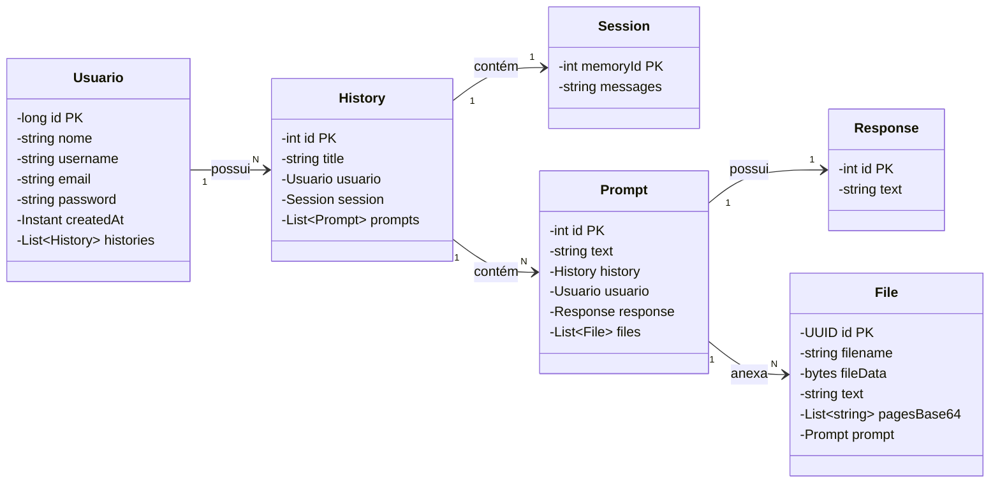
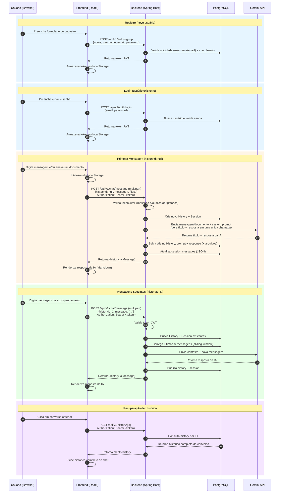

# Chatbot LLM

Aplicação full-stack de chatbot com IA construída com **Spring Boot 4**, **LangChain4j** e **React 19**, alimentada pelo modelo **Gemini Flash Lite** do Google. Possui histórico de conversas persistente, autenticação via **JWT** e **sliding memory window** para gerenciamento eficiente de contexto.

---

## Índice

- [Funcionalidades](#funcionalidades)
- [Tech Stack](#tech-stack)
- [Arquitetura](#arquitetura)
- [Diagrama de Classes](#diagrama-de-classes)
- [Fluxo da Aplicação](#fluxo-da-aplicação)
- [Como rodar](#como-rodar)
  - [Com Docker Compose (recomendado)](#com-docker-compose-recomendado)
  - [Localmente sem Docker](#localmente-sem-docker)
- [Variáveis de ambiente](#variáveis-de-ambiente)
- [API](#api)
- [Sistema de memória](#sistema-de-memória)
- [Estrutura do projeto](#estrutura-do-projeto)
- [Testes](#testes)
- [Deploy na AWS EC2](#deploy-na-aws-ec2)

---

## Funcionalidades

- **Chat com IA** usando o modelo Gemini Flash Lite (Google)
- **Histórico persistente** — conversas são salvas e podem ser retomadas entre sessões
- **Sliding memory window** — as últimas N mensagens são mantidas no contexto da LLM, enquanto o histórico completo é preservado no banco
- **Autenticação JWT** com registro e login reais via email/senha
- **Título de conversa gerado automaticamente** pela IA na primeira mensagem, em uma única chamada à LLM junto com a resposta
- **Envio de documentos (PDF) no chat**, com ou sem mensagem de texto — o sistema resume o conteúdo automaticamente
- **Dashboard do usuário** — edição de perfil, listagem de documentos enviados (com visualização do PDF e do resumo gerado pela IA em Markdown) e acesso rápido às conversas recentes
- **Renderização de Markdown** nas respostas da IA
- **Deploy containerizado** via Docker Compose com Nginx como reverse proxy
- **Documentação OpenAPI/Swagger** disponível em `/swagger-ui.html`

---

## Tech Stack

### Backend

| Tecnologia | Versão | Função |
|---|---|---|
| Java | 21 | Linguagem |
| Spring Boot | 4.x | Framework web |
| LangChain4j | 1.15.x | Integração com LLMs |
| PostgreSQL | 16 | Banco de dados |
| jjwt | 0.12.6 | Autenticação JWT |
| Lombok | — | Redução de boilerplate |
| SpringDoc OpenAPI | 2.8.x | Documentação da API |

### Frontend

| Tecnologia | Versão | Função |
|---|---|---|
| React | 19 | UI |
| TypeScript | 6.x | Tipagem |
| Vite | 8.x | Build tool |
| Tailwind CSS | 4.x | Estilização |
| React Router | 7.x | Roteamento |
| TanStack Query | 5.x | Data fetching e cache |
| Axios | 1.x | Cliente HTTP |
| React Markdown + remark-gfm | — | Renderização de Markdown |

### Infraestrutura

| Tecnologia | Função |
|---|---|
| Docker Compose | Orquestração dos containers |
| Nginx | Reverse proxy + servidor dos assets do SPA |

---

## Arquitetura

A aplicação roda em **3 containers** na mesma rede Docker interna. Apenas o Nginx (frontend) expõe uma porta pública.

```
Browser
  │  HTTP :80
  ▼
┌──────────────────────────────────────┐
│  frontend  (nginx:1.27-alpine)       │
│  Porta exposta: 80                   │
│                                      │
│  /        → assets React (SPA)       │
│  /api/*   → proxy → backend:8080     │
└──────────────┬───────────────────────┘
               │ rede interna Docker
               ▼
┌──────────────────────────────────────┐
│  backend  (eclipse-temurin:21-jre)   │
│  Porta: 8080 (interna)               │
│  Spring Boot + LangChain4j           │
└──────────────┬───────────────────────┘
               │ rede interna Docker
               ▼
┌──────────────────────────────────────┐
│  postgres  (postgres:16-alpine)      │
│  Porta: 5432 (interna)               │
│  Volume persistente: postgres_data   │
└──────────────────────────────────────┘
```

O backend nunca é acessado diretamente pelo browser — todo o tráfego passa pelo Nginx, que age como reverse proxy para `/api/*`.

---

## Diagrama de Classes

### Relacionamentos das Entidades do Backend


### Descrição das Entidades

| Entidade | Propósito |
|----------|-----------|
| **Usuario** | Usuário cadastrado (nome, username, email e senha), autenticado via JWT |
| **History** | Registro completo da conversa, com título (gerado pela IA) vinculando usuário, session e prompts |
| **Session** | Contexto de sliding window armazenado como JSON (últimas N mensagens para a IA) |
| **Prompt** | Mensagem individual do usuário dentro de uma conversa, podendo conter arquivos anexados |
| **Response** | Resposta gerada pela IA para um prompt específico |
| **File** | Documento (PDF) enviado pelo usuário: bytes originais, texto extraído e páginas renderizadas como imagem (para a IA "ler" o conteúdo visualmente) |

---

## Fluxo da Aplicação

### Jornada Completa do Usuário



### Explicação do Fluxo

| Etapa | Descrição |
|-------|-----------|
| **1. Registro/Login** | Usuário cria conta (`/auth/signup`) ou entra com credenciais existentes (`/auth/login`) → backend retorna JWT → token armazenado no `localStorage` |
| **2. Primeira Mensagem** | Usuário envia mensagem e/ou documento com `historyId: null` → backend cria novo `History` + `Session` → gera título e resposta em uma única chamada à IA → salva tudo |
| **3. Continuar Chat** | Mensagens seguintes incluem `historyId` → backend carrega sliding window da `Session` → mantém contexto |
| **4. Visualizar Histórico** | Usuário recupera conversa completa → backend retorna `History` com todos os prompts/responses |

### Conceitos-Chave

- **`historyId: null`** dispara a criação de uma nova conversa (History + Session) e a geração automática do título
- **`historyId: N`** continua uma conversa existente com contexto de sliding memory
- **JWT Token** é armazenado uma vez no `localStorage` e enviado em cada header de requisição autenticada
- **Sliding Window** mantém apenas as últimas N mensagens na session para o contexto da IA, enquanto o histórico completo persiste no DB
- **`message` e `files` são independentes** — é possível enviar apenas um documento sem texto; o backend exige que ao menos um dos dois esteja presente

---

## Como rodar

### Pré-requisitos

- **Docker** e **Docker Compose** (para o setup containerizado)
- — ou —
- **Java 21** e **Node.js 20+** (para rodar localmente)
- **Google Gemini API key** — obtenha gratuitamente em [Google AI Studio](https://aistudio.google.com/)

---

### Com Docker Compose (recomendado)

É a forma mais rápida de subir toda a stack (frontend, backend e banco).

**1. Clone o repositório**

```bash
git clone <url-do-repositorio>
cd chatbot-llm
```

**2. Crie o arquivo `.env`**

```bash
cp .env.example .env
```

Edite o `.env` preenchendo suas credenciais:

```env
# PostgreSQL
CHATBOT_LLM_DB_USERNAME=postgres
CHATBOT_LLM_DB_PASSWORD=sua_senha_segura
POSTGRES_DB=chatbot_llm

# Google Gemini
API_KEY_GEMINI=sua_chave_api_gemini

# JWT — gere um segredo seguro com: openssl rand -base64 32
JWT_SECRET_KEY_CHATBOT_LLM=seu_segredo_base64
```

**3. Suba os containers**

```bash
docker compose up --build -d
```

**Endpoints disponíveis:**

| Serviço | URL |
|---|---|
| Aplicação | `http://localhost` |
| Swagger UI | `http://localhost/api/swagger-ui.html` |

> O backend (`:8080`) e o banco (`:5432`) não são expostos externamente — ficam isolados na rede interna do Docker.

---

### Localmente sem Docker

#### 1. Suba o PostgreSQL

```bash
docker run --name chatbotllmdb -p 5432:5432 \
  -e POSTGRES_PASSWORD=123456 \
  -e POSTGRES_USER=admin \
  -e POSTGRES_DB=chatbotllmdb \
  postgres:16-alpine
```

#### 2. Configure o backend

Edite `backend/src/main/resources/application.properties` (ou crie um `application-dev.properties`) com as credenciais do banco, a chave do Gemini e o segredo JWT.

#### 3. Rode o backend

```bash
cd backend

# Linux/macOS
./mvnw spring-boot:run

# Windows
.\mvnw.cmd spring-boot:run
```

O backend ficará disponível em `http://localhost:8080`.  
Swagger UI: `http://localhost:8080/swagger-ui.html`

#### 4. Rode o frontend

```bash
cd frontend
npm install
npm run dev
```

O frontend ficará disponível em `http://localhost:5173`. Em modo de desenvolvimento, o Vite faz proxy automático de `/api/*` para `http://localhost:8080`.

---

## Variáveis de ambiente

| Variável | Usado por | Descrição | Obrigatório |
|---|---|---|---|
| `CHATBOT_LLM_DB_USERNAME` | backend, postgres | Usuário do PostgreSQL | Sim |
| `CHATBOT_LLM_DB_PASSWORD` | backend, postgres | Senha do PostgreSQL | Sim |
| `POSTGRES_DB` | backend, postgres | Nome do banco (padrão: `chatbot_llm`) | Sim |
| `API_KEY_GEMINI` | backend | Chave da API Google Gemini | Sim |
| `JWT_SECRET_KEY_CHATBOT_LLM` | backend | Segredo JWT em Base64 (mínimo 256 bits) | Sim |

> `CHATBOT_LLM_DB_URL` **não** precisa ser definida — ela é construída automaticamente no `docker-compose.yml` usando o hostname interno `postgres`.

Para gerar um segredo JWT seguro:

```bash
openssl rand -base64 32
```

---

## API

A API segue o padrão REST e está disponível sob `/api/v1`. Todos os endpoints — exceto `/auth/**` — requerem autenticação via Bearer token.

### Autenticação

```http
Authorization: Bearer <jwt_token>
```

### Endpoints

#### Auth

| Método | Endpoint | Descrição | Auth |
|---|---|---|---|
| `POST` | `/api/v1/auth/signup` | Cria um usuário (`nome`, `username`, `email`, `password`) e retorna um JWT | Não |
| `POST` | `/api/v1/auth/login` | Autentica com `email` + `password` e retorna um JWT | Não |

**Body do `POST /auth/signup`:**

```json
{
  "nome": "Ada Lovelace",
  "username": "ada",
  "email": "ada@example.com",
  "password": "senha-segura"
}
```

**Body do `POST /auth/login`:**

```json
{
  "email": "ada@example.com",
  "password": "senha-segura"
}
```

#### Usuário

| Método | Endpoint | Descrição | Auth |
|---|---|---|---|
| `GET` | `/api/v1/users/me` | Retorna o perfil do usuário autenticado (`id`, `nome`, `username`, `email`, `createdAt`) | Sim |
| `PUT` | `/api/v1/users/me` | Atualiza `nome` e/ou `email` do usuário autenticado (campos opcionais) | Sim |

#### Chat

| Método | Endpoint | Descrição | Auth |
|---|---|---|---|
| `POST` | `/api/v1/chat/message` | Envia uma mensagem `multipart/form-data` (`historyId`, `message`, `files[]`). Use `historyId` vazio para iniciar um novo chat. `message` e `files` são opcionais, mas ao menos um deve ser enviado | Sim |

**Campos do `POST /chat/message` (multipart):**

| Campo | Obrigatório | Descrição |
|---|---|---|
| `historyId` | Não | Omitido/nulo para iniciar uma nova conversa |
| `message` | Não* | Texto da mensagem do usuário |
| `files` | Não* | Um ou mais arquivos (PDF) anexados |

\* ao menos um dos dois (`message` ou `files`) deve ser enviado — um documento sozinho é aceito e resumido automaticamente.

#### Arquivos

| Método | Endpoint | Descrição | Auth |
|---|---|---|---|
| `GET` | `/api/v1/files` | Lista os arquivos enviados pelo usuário autenticado, com o resumo gerado pela IA | Sim |
| `GET` | `/api/v1/files/{id}` | Retorna os bytes do PDF (`Content-Type: application/pdf`) para visualização/download | Sim |

#### Histórico

| Método | Endpoint | Descrição | Auth |
|---|---|---|---|
| `GET` | `/api/v1/history/{id}` | Retorna um histórico específico com todos os prompts | Sim |
| `GET` | `/api/v1/history/all/by-user` | Lista todos os históricos do usuário autenticado | Sim |

### Exemplo completo com cURL

```bash
# 1. Criar usuário
curl -s -X POST http://localhost/api/v1/auth/signup \
  -H "Content-Type: application/json" \
  -d '{"nome": "Ada Lovelace", "username": "ada", "email": "ada@example.com", "password": "senha-segura"}'

# 2. Fazer login e obter o token
TOKEN=$(curl -s -X POST http://localhost/api/v1/auth/login \
  -H "Content-Type: application/json" \
  -d '{"email": "ada@example.com", "password": "senha-segura"}')

# 3. Enviar uma mensagem (novo chat)
curl -s -X POST http://localhost/api/v1/chat/message \
  -H "Authorization: Bearer $TOKEN" \
  -F "message=Quem foi Ada Lovelace?"

# 4. Listar históricos do usuário
curl -s http://localhost/api/v1/history/all/by-user \
  -H "Authorization: Bearer $TOKEN"
```

---

## Sistema de memória

O chatbot usa uma **arquitetura dual de memória** para equilibrar custo, latência e qualidade das respostas. Na primeira mensagem de cada conversa, a mesma chamada à LLM que gera a resposta também gera o **título da conversa** (ver [Fluxo da Aplicação](#fluxo-da-aplicação)), evitando uma segunda chamada dedicada só para isso.

### History — registro completo

Armazena **todos os prompts e respostas** sem limite, em tabelas relacionais (`prompt` e `response`). Cresce indefinidamente e é o que o usuário consulta ao abrir uma conversa antiga.

### Session — contexto deslizante

Armazena apenas as **últimas N mensagens** (janela deslizante) em formato JSON. É o que efetivamente é enviado à API do Gemini a cada interação. Quando a janela está cheia, as mensagens mais antigas são descartadas da sessão — mas permanecem no `history`.

```
Nova mensagem do usuário
        │
        ▼
PersistentChatMemoryStore
busca sessão no banco (JSON)
        │
        ▼
MessageWindowChatMemory
mantém só as últimas N mensagens
        │
        ▼
Gemini API
(system prompt + janela de contexto + nova mensagem)
        │
        ▼
Resposta salva no banco
(history + session atualizados)
```

### Por que essa separação?

| | History | Session |
|---|---|---|
| **Propósito** | Registro permanente para o usuário | Contexto enviado à LLM |
| **Limite** | Ilimitado | Configurável (padrão: 20) |
| **Armazenamento** | Tabelas relacionais | JSON na coluna `messages` |
| **Crescimento** | Contínuo | Tamanho fixo (janela deslizante) |

### Ajustando o tamanho da janela

Em `backend/src/main/resources/application.properties`:

```properties
max.messages.window=20
```

Aumentar a janela melhora a coerência em conversas longas, mas aumenta o custo por requisição e a latência.

---

## Estrutura do projeto

```
chatbot-llm/
├── .env.example               # Template das variáveis de ambiente
├── docker-compose.yml         # Orquestração dos 3 containers
│
├── backend/
│   ├── Dockerfile
│   ├── pom.xml
│   └── src/main/java/com/chatbotllm/backend/
│       ├── controller/        # REST controllers (Auth, Usuario, Chat, History, File)
│       ├── service/           # Lógica de negócio e integração com IA
│       │   ├── AuthService        # Signup + login
│       │   ├── UsuarioService     # Consulta/atualização de perfil
│       │   ├── ChatService        # Orquestra a chamada à LLM
│       │   ├── ChatTitleService   # Sanitiza/normaliza o título gerado pela IA
│       │   ├── FileService        # Armazena e recupera documentos (PDF)
│       │   ├── HistoryService     # Cria e consulta históricos
│       │   └── InteractionService # Persiste prompts e respostas
│       ├── data/
│       │   ├── model/         # Entidades JPA (Usuario, History, Session, Prompt, File, etc.)
│       │   ├── dto/           # Objetos de transferência de dados
│       │   ├── request/       # Payloads de entrada
│       │   └── response/      # Payloads de saída
│       ├── exception/         # GlobalExceptionHandler + exceções customizadas (400/401/403/404/409)
│       ├── repositories/      # Interfaces Spring Data JPA
│       ├── security/          # JWT (JwtService, JwtAuthFilter, SecurityConfig)
│       ├── inteface/personas/ # GenericAssistant e TitledAssistant (AiService do LangChain4j)
│       └── utils/             # PersistentChatMemoryStore
│
├── frontend/
│   ├── Dockerfile
│   ├── nginx.conf
│   └── src/
│       ├── components/
│       │   ├── forms/         # LoginForm, RegisterForm
│       │   ├── shared/        # RequireAuth, RedirectIfAuth, FileChip, SideBar, etc.
│       │   ├── history/       # HistoryLink, HistoryList
│       │   ├── input/         # ChatInputBar
│       │   └── messages/      # UserMessage, MessageBubble, ModelResponse (Markdown)
│       ├── layouts/           # Layout principal (sidebar + área de chat)
│       ├── pages/             # ChatPage, DashboardPage, LoginPage, RegisterPage, NotFoundPage
│       ├── providers/         # AuthProvider (gerencia JWT no localStorage)
│       ├── queries/           # Hooks TanStack Query (HistoryQueries, FileQueries, UserQueries)
│       ├── services/          # Clientes HTTP (api, authService, chatService, fileService, userService)
│       └── interfaces/        # Tipos TypeScript do domínio
└── Docker-explain.md          # Documentação detalhada da infra Docker
```

---

## Testes

O backend possui testes unitários para controllers e services usando JUnit 5 + Mockito. Os testes não requerem banco de dados ou conexão com a API do Gemini.

```bash
cd backend
./mvnw test
```

Cobertura atual:

- `AuthController`, `ChatController`, `HistoryController`
- `AuthService`, `HistoryService`, `InteractionService`, `ChatTitleService`
- `JwtService`

---

## Deploy na AWS EC2

**1. Provisione a instância**

Recomenda-se uma instância `t3.small` ou superior com Amazon Linux 2023 ou Ubuntu 22.04.

**2. Instale Docker e Docker Compose**

```bash
# Amazon Linux 2023
sudo dnf install -y docker
sudo systemctl enable --now docker
sudo usermod -aG docker ec2-user

# Docker Compose plugin
sudo mkdir -p /usr/local/lib/docker/cli-plugins
sudo curl -SL https://github.com/docker/compose/releases/latest/download/docker-compose-linux-x86_64 \
  -o /usr/local/lib/docker/cli-plugins/docker-compose
sudo chmod +x /usr/local/lib/docker/cli-plugins/docker-compose
```

**3. Clone e configure**

```bash
git clone <url-do-repositorio>
cd chatbot-llm
cp .env.example .env
# Edite o .env com suas credenciais de produção
```

**4. Configure o Security Group**

Libere **apenas** a porta **80** (HTTP) para `0.0.0.0/0`. As portas 8080 (backend) e 5432 (banco) **não devem** ser abertas — elas ficam isoladas na rede interna do Docker.

**5. Suba a aplicação**

```bash
docker compose up --build -d
```

A aplicação estará acessível em `http://<IP-DA-EC2>`.

### Comandos úteis

```bash
# Ver logs em tempo real de todos os serviços
docker compose logs -f

# Ver logs de um serviço específico
docker compose logs -f backend

# Parar tudo (dados do banco preservados)
docker compose down

# Parar tudo e apagar o banco de dados
docker compose down -v

# Rebuildar e reiniciar apenas o backend (após uma mudança de código)
docker compose build backend && docker compose up -d backend
```

---

## Licença

Este projeto foi desenvolvido para fins acadêmicos como parte da disciplina de **Tópicos em Computação Aplicada**.
