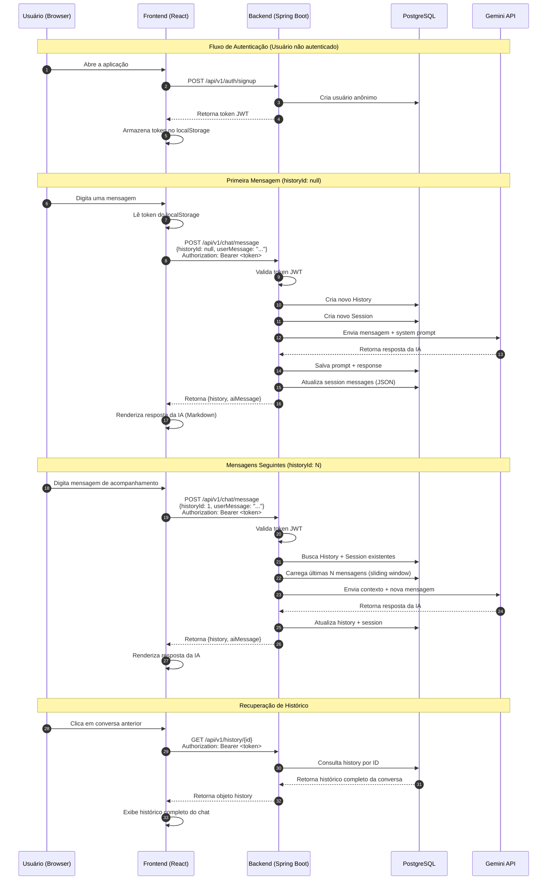
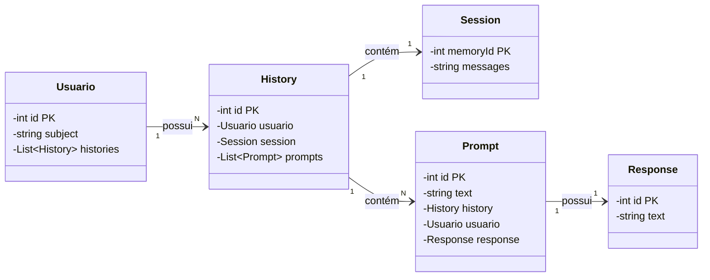

# Chatbot LLM

Aplicação full-stack de chatbot com IA construída com **Spring Boot**, **LangChain4j** e **React**, alimentada pelo modelo **Gemini 3.1 Flash Lite**. Possui histórico de conversas persistente, autenticação via **JWT** e **sliding memory window** para gerenciamento eficiente de contexto.

## Features

- **Conversas com IA** utilizando o modelo Gemini 3.1 Flash Lite do Google
- **Chat history persistente** — retome conversas entre sessões
- **Sliding memory window** — mantém as últimas N mensagens no contexto do LLM enquanto armazena o histórico completo no banco de dados
- **Autenticação JWT** com signup de usuário anônimo
- **Markdown rendering** para respostas da IA
- **Docker Compose** para deploy local simplificado
- **Documentação OpenAPI/Swagger** para a backend API

## Tech Stack

### Backend
- **Java 21** + **Spring Boot 4**
- **LangChain4j** — framework de integração com IA
- **PostgreSQL** — armazenamento persistente de dados
- **JWT (jjwt)** — autenticação
- **Lombok** — redução de boilerplate
- **SpringDoc OpenAPI** — documentação da API

### Frontend
- **React 19** + **TypeScript**
- **Vite** — build tool
- **Tailwind CSS 4** — estilização
- **React Router 7** — roteamento
- **TanStack React Query** — data fetching
- **Axios** — cliente HTTP
- **React Markdown** + **remark-gfm** — renderização de Markdown
- **Lucide React** — ícones

### Infrastructure
- **Docker Compose** — deploy containerizado de multi-service
- **Nginx** — reverse proxy do frontend

## Architecture

```
┌──────────────┐         ┌──────────────────┐         ┌──────────────┐
│   Frontend   │ ◄─────► │     Backend      │ ◄─────► │   Gemini     │
│  React + TS  │  HTTP   │ Spring Boot 4    │  REST    │   API        │
│              │         │ + LangChain4j    │         │              │
└──────────────┘         └────────┬─────────┘         └──────────────┘
                                  │
                           ┌──────▼─────────┐
                           │   PostgreSQL   │
                           │  (history,     │
                           │   sessions)    │
                           └────────────────┘
```

## Fluxo da Aplicação

### Jornada Completa do Usuário



### Explicação do Fluxo

| Etapa | Descrição |
|-------|-----------|
| **1. Signup** | Usuário abre a aplicação → frontend faz signup automático → backend cria usuário anônimo + JWT → token armazenado no `localStorage` |
| **2. Primeira Mensagem** | Usuário envia mensagem com `historyId: null` → backend cria novo `History` + `Session` → envia para Gemini → salva resposta |
| **3. Continuar Chat** | Mensagens seguintes incluem `historyId` → backend carrega sliding window da `Session` → mantém contexto |
| **4. Visualizar Histórico** | Usuário recupera conversa completa → backend retorna `History` com todos os prompts/responses |

### Conceitos-Chave

- **`historyId: null`** dispara a criação de uma nova conversa (History + Session)
- **`historyId: N`** continua uma conversa existente com contexto de sliding memory
- **JWT Token** é armazenado uma vez no `localStorage` e enviado em cada header de requisição autenticada
- **Sliding Window** mantém apenas as últimas N mensagens na session para o contexto da IA, enquanto o histórico completo persiste no DB

## Diagrama de Classes

### Relacionamentos das Entidades do Backend



### Descrição das Entidades

| Entidade | Propósito |
|----------|-----------|
| **Usuario** | Representa um usuário anônimo identificado pelo subject do JWT |
| **History** | Registro completo da conversa, vinculando usuário, session e prompts |
| **Session** | Contexto de sliding window armazenado como JSON (últimas N mensagens para a IA) |
| **Prompt** | Mensagem individual do usuário dentro de uma conversa |
| **Response** | Resposta gerada pela IA para um prompt específico |

## Getting Started

### Prerequisites

- **Java 21**
- **Node.js 18+**
- **Docker & Docker Compose** (opcional, para setup containerizado)
- **Google Gemini API key** — obtenha em [Google AI Studio](https://aistudio.google.com/)

### Quick Start com Docker Compose

A forma mais rápida de rodar a stack completa:

1. **Clone o repositório**

```bash
cd chatbot-llm
```

2. **Crie um arquivo `.env`** a partir do exemplo:

```bash
copy .env.example .env
```

Edite o `.env` com suas credenciais:

```env
# PostgreSQL
CHATBOT_LLM_DB_USERNAME=postgres
CHATBOT_LLM_DB_PASSWORD=sua_senha_segura
POSTGRES_DB=chatbot_llm

# Google Gemini API key
API_KEY_GEMINI=sua_chave_api_gemini_aqui

# JWT secret (Base64-encoded, mínimo 256 bits)
# Gere com: openssl rand -base64 32
JWT_SECRET_KEY_CHATBOT_LLM=seu_segredo_base64_aqui
```

3. **Inicie todos os services**:

```bash
docker compose up --build
```

- Frontend: `http://localhost`
- Backend API: `http://localhost:8080`
- Swagger UI: `http://localhost:8080/swagger-ui.html`

### Rodando Localmente (sem Docker)

#### 1. Inicie o PostgreSQL

```bash
docker run --name chatbotllmdb -p 5432:5432 \
  -e POSTGRES_PASSWORD=123456 \
  -e POSTGRES_USER=admin \
  -e POSTGRES_DB=chatbotllmdb \
  postgres:16.9
```

#### 2. Configure o Backend

Atualize `backend/src/main/resources/application.properties` com as credenciais do banco, chave do Gemini e JWT secret.

#### 3. Execute o Backend

```bash
cd backend
# No Windows:
.\mvnw.cmd spring-boot:run

# No Linux/macOS:
./mvnw spring-boot:run
```

O backend estará disponível em `http://localhost:8080`.

#### 4. Execute o Frontend

```bash
cd frontend
npm install
npm run dev
```

O frontend estará disponível em `http://localhost:5173`.

## API Overview

### Authentication

| Method | Endpoint | Description |
|--------|----------|-------------|
| `POST` | `/api/v1/auth/signup` | Cria um usuário anônimo e retorna um JWT token |

### Chat

| Method | Endpoint | Description | Auth |
|--------|----------|-------------|------|
| `POST` | `/api/v1/chat/message` | Envia uma mensagem (use `historyId: null` para um novo chat) | Bearer JWT |

### History

| Method | Endpoint | Description | Auth |
|--------|----------|-------------|------|
| `GET` | `/api/v1/history/{id}` | Retorna um conversation history específico | Bearer JWT |
| `GET` | `/api/v1/history/all/by-user` | Lista todas as conversas do usuário autenticado | Bearer JWT |

### Exemplo: Criar usuário e enviar mensagem

```bash
# 1. Sign up
curl -X POST http://localhost:8080/api/v1/auth/signup

# 2. Enviar mensagem (substitua <token> pelo JWT retornado no passo 1)
curl -X POST http://localhost:8080/api/v1/chat/message \
  -H "Authorization: Bearer <token>" \
  -H "Content-Type: application/json" \
  -d '{"historyId":null,"userMessage":"Olá, como você pode me ajudar?"}'
```

## Memory System

O chatbot utiliza uma **dual-memory architecture** para eficiência:

| Aspecto | History | Session |
|---------|---------|---------|
| **Propósito** | Registro completo e permanente da conversa | Sliding window context para o LLM |
| **Limite de mensagens** | Ilimitado | Configurável (padrão: 20) |
| **Armazenamento** | Tabelas relacionais (prompt, response) | JSON em `session.messages` |
| **Crescimento** | Contínuo | Janela de tamanho fixo |

### Por que essa separação?

1. **Controle de custo** — Enviar 1000 mensagens ao Gemini a cada turn é caro
2. **Menor latência** — Contexto menor = respostas mais rápidas
3. **Histórico completo disponível** — Usuários podem revisar toda a conversa
4. **Qualidade da resposta** — Contexto demais pode confundir o modelo

### Ajustando a memory window

Edite o `application.properties`:

```properties
max.messages.window=20
```

## Project Structure

```
chatbot-llm/
├── backend/
│   ├── src/main/java/
│   │   └── com/chatbot-llm/
│   │       ├── controller/    # REST controllers
│   │       ├── service/       # Business logic & AI integration
│   │       ├── model/         # JPA entities
│   │       ├── repository/    # Data access layer
│   │       ├── dto/           # Data transfer objects
│   │       ├── security/      # JWT auth & filters
│   │       └── config/        # Spring configuration
│   ├── src/main/resources/
│   │   ├── application.properties
│   │   └── system_message.txt  # AI assistant system prompt
│   ├── pom.xml
│   └── Dockerfile
├── frontend/
│   ├── src/
│   │   ├── components/        # React components
│   │   ├── pages/             # Page components
│   │   ├── services/          # API client (Axios)
│   │   ├── hooks/             # Custom React hooks
│   │   └── types/             # TypeScript types
│   ├── package.json
│   ├── vite.config.ts
│   └── Dockerfile
├── docker-compose.yml
└── .env.example
```

## Environment Variables

| Variável | Descrição | Obrigatório |
|----------|-----------|-------------|
| `CHATBOT_LLM_DB_USERNAME` | PostgreSQL username | Sim |
| `CHATBOT_LLM_DB_PASSWORD` | PostgreSQL password | Sim |
| `POSTGRES_DB` | PostgreSQL database name | Sim |
| `API_KEY_GEMINI` | Google Gemini API key | Sim |
| `JWT_SECRET_KEY_CHATBOT_LLM` | JWT secret em Base64 (mín. 256 bits) | Sim |

## License

Este projeto foi desenvolvido para fins acadêmicos como parte da disciplina de **Tópicos em Computação Aplicada**.
