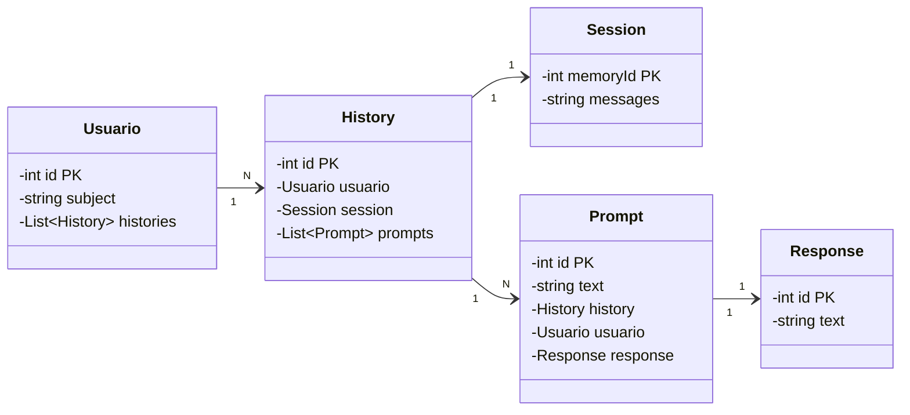

# Chatbot LLM Backend

API backend do chatbot desenvolvida com **Spring Boot** e **LangChain4j**. Ela expõe endpoints para autenticação via JWT, envio de mensagens para o modelo de IA e consulta do histórico de conversas por usuário.

## Visão geral

Este projeto foi pensado para servir o front-end de um chatbot com memória persistente. A API:

- cria usuários anônimos com `signup` e devolve um **token JWT**;
- recebe mensagens do usuário e encaminha para a camada de IA;
- persiste histórico, prompts, respostas e sessão da conversa em banco PostgreSQL;
- protege quase todos os endpoints com autenticação Bearer JWT.

## Stack utilizada

- **Java 21**
- **Spring Boot 4**
- **PostgreSQL**
- **LangChain4j**

## Estrutura da API

A aplicação expõe os recursos principais em `/api/v1`:

- `/api/v1/auth` → autenticação
- `/api/v1/chat` → interação com o chatbot
- `/api/v1/history` → consulta de histórico

## Autenticação

A autenticação é baseada em **JWT**.

### Fluxo

1. O cliente chama `POST /api/v1/auth/signup`.
2. A API cria um usuário e gera um token JWT.
3. O front passa esse token no header:

```http
Authorization: Bearer <token>
```

4. Os endpoints protegidos aceitam a requisição somente com token válido.

### Regras de segurança

- `POST /api/v1/auth/**` é público.
- Qualquer outro endpoint exige autenticação.
- A aplicação usa sessão stateless.

## Endpoints

### 1) Criar usuário e token

**POST** `/api/v1/auth/signup`

Cria um usuário e retorna um JWT para uso nas próximas chamadas.

**Resposta:**
- `200 OK`
- Corpo: token JWT retornado pelo serviço

**Exemplo de uso**

```bash
curl -X POST http://localhost:8080/api/v1/auth/signup
```

---

### 2) Enviar mensagem a um chat novo

**POST** `/api/v1/chat/message`

Envia uma mensagem do usuário para o chatbot.

**Headers:**

```http
Authorization: Bearer <token>
Content-Type: application/json
```

**Body:**

```json
{
  "historyId": null,
  "userMessage": "Olá, como você pode me ajudar?"
}
```

**Campos:**

- `historyId` → opcional. Se vier `null`, uma nova conversa/histórico pode ser criada.
- `userMessage` → mensagem enviada pelo usuário.

**Resposta:**

- `201 Created`
- Retorna um objeto com:
  - `history`: dados do histórico associado
  - `aiMessage`: resposta gerada pela IA

**Exemplo de uso**

```bash
curl -X POST http://localhost:8080/api/v1/chat/message \
  -H "Authorization: Bearer <token>" \
  -H "Content-Type: application/json" \
  -d '{"historyId":null,"userMessage":"Explique o que é LangChain4j"}'
```

---

### 3) Enviar mensagem para um chat existente
**POST** `/api/v1/chat/message`

Mesma estrutura do endpoint anterior, mas com `historyId` preenchido para continuar uma conversa já iniciada.

**Exemplo de uso**

```bash
curl -X POST http://localhost:8080/api/v1/chat/message 
    -H "Authorization: Bearer <token>"
    -H "Content-Type: application/json"
    -d '{"historyId":1,"userMessage":"Me conte mais sobre o que falamos antes?"}'
```

### 4) Buscar um histórico específico

**GET** `/api/v1/history/{id}`

Retorna um histórico pelo seu identificador.

**Headers:**

```http
Authorization: Bearer <token>
```

**Exemplo de uso**

```bash
curl http://localhost:8080/api/v1/history/1 \
  -H "Authorization: Bearer <token>"
```

---

### 5) Listar históricos do usuário autenticado

**GET** `/api/v1/history/all/by-user`

Retorna todos os históricos vinculados ao usuário autenticado.

**Headers:**

```http
Authorization: Bearer <token>
```

**Exemplo de uso**

```bash
curl http://localhost:8080/api/v1/history/all/by-user
  -H "Authorization: Bearer <token>"
```

## Formato das respostas principais

### `SendChatMessageResponse`

```json
{
  "history": {
    "id": 1,
    "prompts": [
      {
        "text": "My name is Napoleao Bonaparte",
        "response": {
          "text": "Hello, Napoleao Bonaparte! How can I assist you today?"
        }
      },
      {
        "text": "What is my name?",
        "response": {
          "text": "Your name is Napoleao Bonaparte. How can I help you further?"
        }
      }
    ],
    "session": {
      "messages": [
        {
          "text": "Você é um assistente genérico",
          "type": "SYSTEM"
        },
        {
          "contents": [
            {
              "text": "My name is Napoleao Bonaparte",
              "type": "TEXT"
            }
          ],
          "type": "USER"
        },
        {
          "text": "Hello, Napoleao Bonaparte! How can I assist you today?",
          "toolExecutionRequests": [],
          "attributes": {},
          "type": "AI"
        },
        {
          "contents": [
            {
              "text": "What is my name?",
              "type": "TEXT"
            }
          ],
          "type": "USER"
        },
        {
          "text": "Your name is Napoleao Bonaparte. How can I help you further?",
          "toolExecutionRequests": [],
          "attributes": {},
          "type": "AI"
        }
      ]
    }
  },
  "aiMessage": "Your name is Napoleao Bonaparte. How can I help you further?"
}
```

### `HistoryDto`

```json
{
  "id": 1,
  "prompts": [
    {
      "text": "Pergunta do usuário",
      "response": {
        "text": "Resposta da IA"
      }
    }
  ],
  "session": {
    "messages": "..."
  }
}
```

## Modelo de dados

A base possui, entre outras, as seguintes entidades:

- `usuario`
- `history`
- `session`
- `prompt`
- `response`

### Relações principais

### 🗄️ Diagrama de classes simplificado


- Um `usuario` pode ter vários `history`.
- Cada `history` possui uma `session`.
- Cada `history` contém vários `prompt`.
- Cada `prompt` referencia uma `response`.

## Diferença entre History e Session

A aplicação separa dois conceitos de memória: **`history`** (registro completo) e **`session`** (contexto deslizante). Essa separação é fundamental para o funcionamento eficiente do chatbot.

### History: Registro Completo Permanente

O `history` armazena o **histórico completo e imutável** de toda a conversa entre o usuário e a IA.

**Características:**

- Armazena **todos os prompts e responses** sem limite
- É consultado pelo usuário quando quer ver **toda** a conversa
- Baseado em tabelas relacional (entidades `prompt` e `response`)
- Sem aplicação de janela deslizante
- Cresce continuamente conforme a conversa avança

**Exemplo de histórico completo:**

```
Conversa entre Juan e o chatbot:

1. Usuário: "Olá, como você funciona?"
   IA: "Sou um assistente inteligente baseado em Gemini."

2. Usuário: "Explique LangChain4j"
   IA: "LangChain4j é um framework Java para LLMs..."

3. Usuário: "E sobre o que é uma janela de contexto?"
   IA: "Janela de contexto é o número máximo de mensagens..."

... (e assim por diante, indefinidamente)
```

### Session: Contexto com Janela Deslizante

A `session` armazena o **contexto atual da conversa** usando a estratégia de **janela deslizante** (`MAX_MESSAGES_WINDOW`).

**Características:**

- Armazena apenas as **últimas N mensagens** (no caso, 10)
- É consumida pelo **modelo de IA** para gerar respostas
- Mantém um campo `messages` com **JSON serializado**
- Desserializado para `List<ChatMessage>` pelo LangChain4j
- Permite que a IA "saiba" do contexto recente sem custo infinito

**Exemplo de conteúdo `messages` (JSON):**

A coluna `messages` contém um JSON que representa as últimas mensagens:

```json
[
  {
    "text": "Você é um assistente genérico",
    "type": "SYSTEM"
  },
  {
    "contents": [
      {
        "text": "My name is Napoleao Bonaparte",
        "type": "TEXT"
      }
    ],
    "type": "USER"
  },
  {
    "text": "Hello, Napoleao Bonaparte! How can I assist you today?",
    "toolExecutionRequests": [],
    "attributes": {},
    "type": "AI"
  },
  {
    "contents": [
      {
        "text": "What is my name?",
        "type": "TEXT"
      }
    ],
    "type": "USER"
  },
  {
    "text": "Your name is Napoleao Bonaparte. How can I help you further?",
    "toolExecutionRequests": [],
    "attributes": {},
    "type": "AI"
  }
]
```

Quando uma nova mensagem chega:
1. As mensagens são desserializadas (JSON → `List<ChatMessage>`)
2. Mantém-se apenas as últimas 10
3. Envia-se ao Gemini: `system_message` + essas 10 mensagens + nova mensagem
4. Recebe-se a resposta
5. Atualiza-se o JSON com as novas mensagens

### Comparação lado a lado

| Aspecto                 | History                                | Session                     |
|-------------------------|----------------------------------------|-----------------------------|
| **Propósito**           | Registro completo da conversa          | Contexto enviado ao LLM     |
| **Limite de mensagens** | Sem limit                              | MAX_MESSAGES_WINDOW = 10    |
| **Armazenamento**       | Tabelas relacionais (prompt, response) | JSON em texto (messages)    |
| **Crescimento**         | Infinito (conversa longa)              | Fixo (sempre 10 max)        |
| **Persistência**        | Permanente                             | Atualizado a cada interação |
| **Formato**             | Objetos normalizados                   | JSON string                 |


### Por que essa separação?

1. **Economia de custos**: Não enviar 1000 mensagens ao Gemini a cada interação
2. **Latência**: Contexto menor = resposta mais rápida
3. **Histórico completo**: Usuário pode acessar toda a conversa depois
4. **Qualidade de resposta**: Às vezes contexto demais confunde o modelo
5. **Escalabilidade**: Conversas longas não "explodem" em memória/tokens

### Ajustando o tamanho da janela

Se precisar de mais contexto (ex: 20 mensagens):

```properties
# em application.properties
max.messages.window=20
```

O `history` continua armazenando tudo, mas agora a `session` mantém 20 mensagens em vez de 10.

## LangChain4j e Memória de Contexto

A aplicação usa **LangChain4j**, uma biblioteca Java que facilita a integração com modelos de IA. Um dos recursos mais importantes é a **memória conversacional com janela deslizante** (`MessageWindowChatMemory`).

### O que é LangChain4j?

LangChain4j é um framework que abstrai a complexidade de trabalhar com LLMs (Large Language Models). Ele oferece:

- **Integração com múltiplos provedores**: OpenAI, Gemini, Claude, etc.
- **Gerenciamento de memória**: histórico de mensagens persistente ou em memória
- **Services declarativas**: interfaces Java que se transformam em chamadas ao LLM
- **Serialização/desserialização**: conversão automática de mensagens para JSON

### Janela de Contexto (Message Window)

O projeto implementa um padrão de **janela deslizante de mensagens** para manter o contexto da conversa sem crescer infinitamente.

#### Configuração atual

```java
import org.springframework.beans.factory.annotation.Value;

// Em ChatService.java
@Value("${max.messages.window}")
private Integer MAX_MESSAGES_WINDOW;
```
```properties
# Em application-prod.properties
max.messages.window=10
```

Esta configuração significa:

- **No máximo 10 mensagens anteriores** são mantidas em memória durante a interação com o LLM
- Quando uma nova mensagem chega, a janela "desliza": as mensagens mais antigas são descartadas da memória
- O histórico **completo** continua salvo no banco de dados (para consultas posteriores)
- Apenas as últimas 10 mensagens são **enviadas ao modelo** a cada nova interação

#### Por que usar uma janela?

1. **Custo**: APIs de LLM cobram por token. Carregar todo o histórico é caro.
2. **Latência**: Quanto menor o contexto, mais rápida a resposta.
3. **Qualidade**: Às vezes, contexto demais confunde o modelo.

#### Fluxo de memória

```
Usuário envia mensagem
     ↓
ChatService resolve o histórico existente
     ↓
PersistentChatMemoryStore busca as últimas mensagens do banco
     ↓
MessageWindowChatMemory mantém apenas as 10 últimas em memória
     ↓
GenericAssistant envia para Gemini + sistema prompt
     ↓
Gemini retorna resposta
     ↓
InteractionService salva prompt + resposta no banco
```

### Integração com Gemini API

A aplicação usa a API OpenAI como proxy para o Gemini:

```java
ChatModel model = OpenAiChatModel.builder()
    .baseUrl(GEMINI_OPEN_AI_URL)  // URL: https://generativelanguage.googleapis.com/v1beta/openai/
    .apiKey(GEMINI_API_KEY)
    .modelName("gemini-3.1-flash-lite")
    .build();
```

O Gemini oferece:
- Modelo rápido e eficiente (`flash-lite`)
- Gratuito para uso acadêmico/experimental
- Compatível com a interface OpenAI

### Memória Persistente

A memória é **persistida no banco de dados** através do `PersistentChatMemoryStore`:

```java
public class PersistentChatMemoryStore implements ChatMemoryStore {
    
    public List<ChatMessage> getMessages(Object memoryId) {
        // Busca session no banco pelo memoryId. Ex.: sessionRepo.findById(memoryId)
        // Busca as mensagens JSON da session recuperada
        String messages = session.getMessages();
        return ChatMessageDeserializer.messagesFromJson(messages);
    }
    
    public void updateMessages(Object memoryId, List<ChatMessage> messages) {
        // Busca session no banco pelo memoryId
        // Salva as mensagens serializadas em JSON
        String messagesToJson = ChatMessageSerializer.messagesToJson(messages);
        session.setMessages(messagesToJson);
        // Atualiza a session no banco. Ex.: sessionRepo.save(session)
    }
}
```

As mensagens são armazenadas como **JSON** na coluna `messages` da tabela `session`:

```json
[
  {
    "text": "Você é um assistente genérico",
    "type": "SYSTEM"
  },
  {
    "contents": [
      {
        "text": "My name is Napoleao Bonaparte",
        "type": "TEXT"
      }
    ],
    "type": "USER"
  },
  {
    "text": "Hello, Napoleao Bonaparte! How can I assist you today?",
    "toolExecutionRequests": [],
    "attributes": {},
    "type": "AI"
  },
  {
    "contents": [
      {
        "text": "What is my name?",
        "type": "TEXT"
      }
    ],
    "type": "USER"
  },
  {
    "text": "Your name is Napoleao Bonaparte. How can I help you further?",
    "toolExecutionRequests": [],
    "attributes": {},
    "type": "AI"
  }
]
```

### Assistant Declarativo

Foi implementada uma interface `GenericAssistant` (obs: pode ser criada de maneira arbitrária) que define o comportamento do chatbot através de um system prompt:

```java
@AiService
public interface GenericAssistant {
    @SystemMessage(fromResource = "system_message.txt")
    String chat(@MemoryId Long memoryId, @UserMessage String message);
}
```

#### `@SystemMessage`

Carregada de `system_message.txt`, define o **comportamento e persona** do assistente. Exemplo:

```text
Você é um assistente útil e amigável.
Responda sempre em português.
Seja conciso e direto.
```

### Ajustando a configuração

#### Aumentar a janela de mensagens

Se a conversa precisa de mais contexto:

```properties
# Agora 20 mensagens 
max.messages.window=20
```

**Trade-off**: Mais contexto = respostas melhores, mas mais tokens gastos e latência maior.

#### Usar um sistema de memória diferente

Para remover persistência e usar apenas memória volátil:

```java
ChatMemoryProvider chatMemoryProvider = memoryId ->
    MessageWindowChatMemory.builder()
        .maxMessages(MAX_MESSAGES_WINDOW)
        // Sem chatMemoryStore → mantém em memória
        .build();
```

#### Ajustar o modelo

```java
ChatModel model = OpenAiChatModel.builder()
    .baseUrl(GEMINI_OPEN_AI_URL)
    .apiKey(GEMINI_API_KEY)
    .modelName("gemini-3.1-pro")  // Modelo mais poderoso
    .build();
```

## Configuração de ambiente

### Arquivos de configuração

O projeto possui perfis de configuração para desenvolvimento e produção:

- `src/main/resources/application-dev.properties`
- `src/main/resources/application-prod.properties`

### Variáveis de ambiente esperadas

No perfil de produção, estas variáveis devem estar disponíveis:

- `CHATBOT_LLM_DB_URL`
- `CHATBOT_LLM_DB_USERNAME`
- `CHATBOT_LLM_DB_PASSWORD`
- `CHATBOT_LLM_SECRET_KEY`
- `API_KEY_GEMINI`

## Banco de dados

O projeto usa PostgreSQL.

### Exemplo de container local

```bash
docker run --name chatbotllmdb -p 5432:5432 -e POSTGRES_PASSWORD=123456 -e POSTGRES_USER=admin -e POSTGRES_DB=chatbotllmdb postgres:16.9
```

## Execução local

### 1) Subir o banco

Use o comando acima para iniciar o PostgreSQL local.

### 2) Configurar as variáveis de ambiente

Defina a chave da API e o segredo do JWT antes de iniciar a aplicação.

### 3) Rodar a aplicação

```bash
./mvnw spring-boot:run
```

No Windows PowerShell:

```powershell
.\mvnw.cmd spring-boot:run
```
## Observações importantes

- O backend foi feito para trabalhar com um front-end consumidor de API.
- O histórico é salvo no banco, permitindo retomar conversas anteriores.
- A camada de IA usa **LangChain4j**, facilitando a integração com o modelo generativo.
- A janela de contexto é configurável, permitindo balancear custo e qualidade.